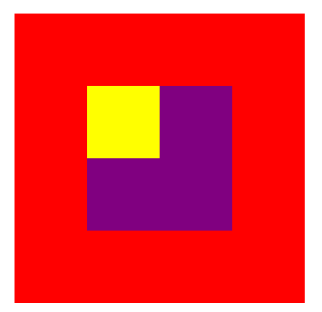
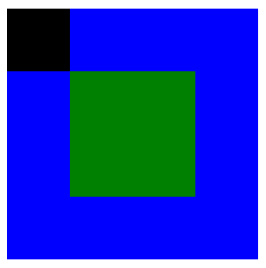

## Posicionando cajas
### Objetivo

- El desarrollo de esta pagina tiene como objetivo utilizar position, para el posicionamiento de cajas aplicado lo aprendido en positioning and floats.

### Herramientas utilizadas
- HTML5
- CSS3

### Fuentes consultadas
- [Laboratoria LMS] :https://lms.laboratoria.la/cohorts/lim-2017-09-bc-core-pm/courses/interactive-site/00-html-and-css/06-positioning-and-floats
- [EDteam] : https://www.youtube.com/watch?v=fQmdNY8u2F4

### Imagen

